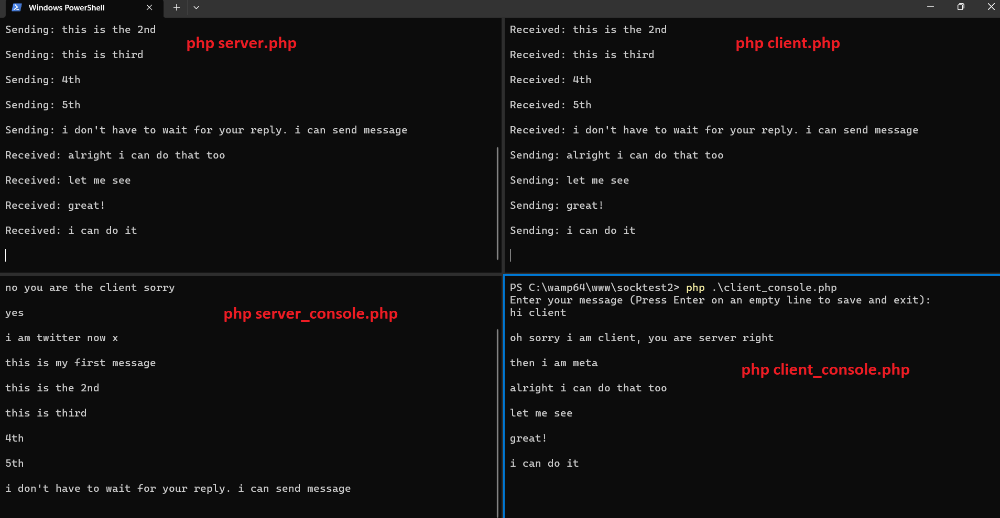

# PHP-PracticalExample-AsyncSocket

- This is a practical example to test TCP Socket Server and Client.
- This is using Reach PHP Socket library.
- Learn [ReactPHP](https://reactphp.org/)

## Installation

- Clone the application. Go to the application directory.
- Run `composer install` to install React PHP.

## Resources

- **Vanilla PHP** just means plain original PHP without any framework.

## How to use

- Run 4 console below:

1. `php server.php` - this will establish a server listening socket.
2. `php client.php` - this wlll attempt to connect to the server in the same host. Modify the code if you want to test from another host.
3. `php server_console.php` - this is where you will enter a message for server. this code writes the message into a server.txt file.
4. `php client_console.php` - this is where you will enter a message for client. this code writes the message into a client.txt file.

## Screenshots

## Developer

- [Jerome Soriano](https://github.com/dvxgit-jsoriano)

*"Feel free to read, use, and apply to your projects."*